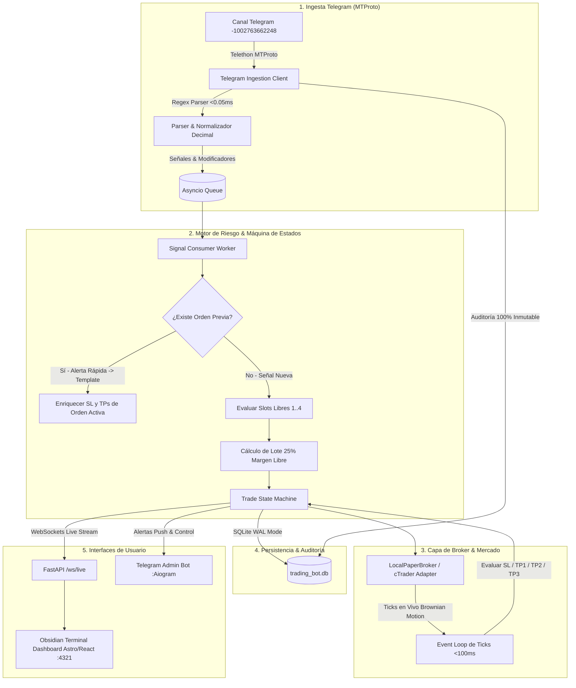
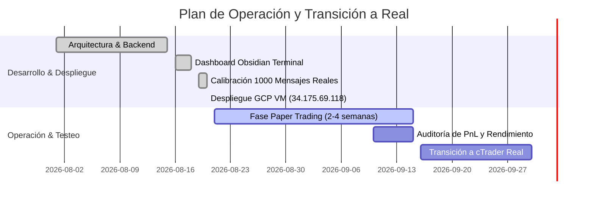

# 🏆 GOLD-EX: Motor de Trading Autónomo XAUUSD (Telegram ➔ Broker)

Sistema de trading algorítmico y cuantitativo de alta fidelidad para el par **XAUUSD (Oro)**. Ingesta señales en tiempo real mediante MTProto (Telethon), gestiona el capital con una estricta máquina de estados (4 slots concurrentes de 25% de margen libre con trailing SL por hitos), ejecuta órdenes en broker (Simulación Local Paper / cTrader Open API) y expone una interfaz de monitoreo estilo **Obsidian Terminal** (FastAPI + WebSockets + Astro/React) y un bot de control administrativo en Telegram.

---

## 🏛️ Arquitectura del Sistema



---

## 📊 Estado Actual del Proyecto y Despliegue en la Nube

- **Estado:** 🟢 **EN PRODUCCIÓN (MODO PAPER TRADING 24/7)**
- **Servidor Cloud:** Google Cloud Platform VM (`europe-southwest1` Madrid)
- **Dashboard Web:** `http://34.175.69.118:4321`
- **Backend API:** `http://34.175.69.118:8000/docs`
- **Canal de Señales:** `-1002763662248` (Chartoro FX)
- **Ingesta:** Calibrada con **1.000 mensajes reales** (Julio 2026 – Agosto 2026) con **0% de falsos positivos**.
- **Normalización Decimal:** `sanitize_price_str` inmune a comas españolas (`4383,69`), miles (`4.383,69`) o puntos estándar (`4383.69`).
- **Enriquecimiento de Órdenes:** Deduplica automáticamente las alertas rápidas (`BUY NOW`) con las plantillas formales (`SIGNAL ALERT`).
- **Tests Automatizados:** **36/36 tests superados** en 0.59s (`pytest tests/ -v`).

---

## 🗺️ Hoja de Ruta (Roadmap)



---

## 🛠️ Estructura del Repositorio

```text
bot_trading/
├── backend/
│   ├── config.py              # Pydantic Settings v2 (.env)
│   ├── main.py                # FastAPI app y Lifecycle Manager
│   ├── api/                   # Rutas REST y WebSocket /ws/live
│   ├── broker/                # LocalPaperBroker y LiveBrokerAdapter (cTrader)
│   ├── database/              # SQLAlchemy 2.0 Async, Modelos y Reconciliación post-reboot
│   ├── ingesta/               # Telethon MTProto client, regex parser, normalizador decimal
│   ├── risk/                  # Motor de 4 Slots, cálculo de lotes y Trailing SL
│   └── telegram_admin/        # Bot privado de control móvil (Aiogram 3.x)
├── frontend/                  # Dashboard Obsidian Terminal (Astro 5 + React 19 + Tailwind)
├── scripts/                   # Scripts de auditoría, scraping histórico y tests
├── tests/                     # 36 tests automatizados de integración y unitarios
├── docker-compose.yml         # Orquestación de Backend + Frontend
├── Dockerfile                 # Contenedor de producción
└── TUTORIAL_SETUP.md          # Guía detallada de instalación
```
