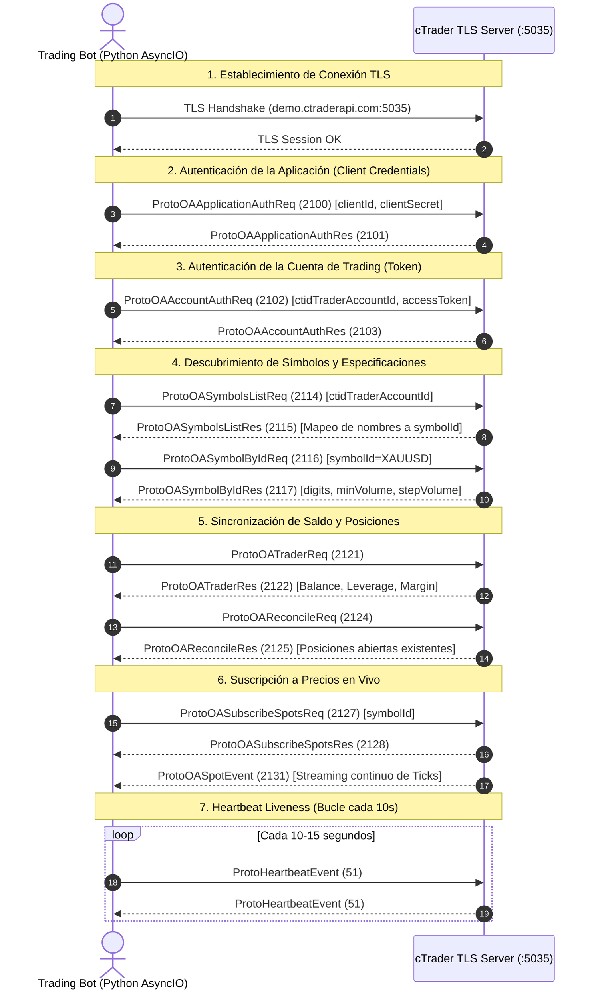

# CTRADER OPEN API 2.0 — MASTER SPECIFICATION & ALGOTRADING ARCHITECTURE
**Documento de Referencia Técnica Canónica, Auditoría y Framework de Exportación**  
*Versión: 2.0 (cTrader Open API v2 / Spotware Systems Ltd)*  
*Compatibilidad: Python 3.10+ (asyncio) | Protobuf & JSON*

---

## 📋 PROPÓSITO DEL DOCUMENTO

Este documento cumple una doble función técnica crítica:
1. **Contexto Inmediato de Auditoría y Corrección (`bot_trading`):** Sirve como la fuente definitiva de verdad para contrastar el código actual del proyecto (`ctrader_protocol.py`, `live_adapter.py`), detectar inconsistencias de protocolo, evitar fallos lógicos sutiles de serialización y blindar la ejecución real.
2. **Framework Exportable para Futuros Bots de Algotrading:** Diseñado como un artefacto independiente, autosuficiente y modular para ser exportado a cualquier nuevo repositorio de trading algorítmico, acelerando el desarrollo de futuros sistemas cuantitativos sobre cTrader sin reinventar la rueda ni repetir errores históricos.

---

## 🌐 1. ARQUITECTURA DE CONEXIÓN Y ENDPOINTS DE CTRADER

cTrader Open API opera sobre conexiones persistentes TCP con cifrado TLS obligatorio.

### 1.1 Endpoints Oficiales
| Entorno | Host | Puerto Protobuf | Puerto JSON | Uso |
| :--- | :--- | :---: | :---: | :--- |
| **Demo** | `demo.ctraderapi.com` | `5035` | `5036` | Pruebas, backtesting en vivo, cuentas demo |
| **Live** | `live.ctraderapi.com` | `5035` | `5036` | Cuentas reales con dinero real |

> ⚠️ **REGLA DE ORO:** Las cuentas DEMO no pueden autenticarse en el host LIVE ni viceversa. Intentar autenticar una cuenta demo en `live.ctraderapi.com` arrojará errores de tipo `CH_CLIENT_AUTH_FAILURE` o rechazo de autenticación de cuenta.

### 1.2 Rate Limits del Broker
* **Peticiones generales:** Máximo **50 peticiones por segundo** por conexión TCP.
* **Peticiones de datos históricos:** Máximo **5 peticiones por segundo** por conexión.
* Si se supera el límite, cTrader responderá con error `BLOCKED_PAYLOAD_TYPE` y devolverá el campo `retryAfter` (en segundos).

---

## ⚡ 2. PROTOBUF VS JSON: CUÁNDO USAR CADA UNO

cTrader ofrece soporte nativo para dos transportes sobre TLS:

| Característica | Protobuf (Puerto 5035) | JSON (Puerto 5036) |
| :--- | :--- | :--- |
| **Latencia / Ancho de Banda** | Ultra-baja (<1ms serialización, binario compacto) | Media (mayor overhead de texto UTF-8) |
| **Complejidad de Mapeo** | Estricta (requiere tags numéricos exactos y tipos de wire) | Flexible (clave-valor legible, sin compilador) |
| **Mantenimiento** | Blindado si se compilan los `.proto` oficiales | Inmune a compiladores, muy fácil de depurar con logs |
| **Recomendación de Uso** | Bots de alta frecuencia (HFT), scalping, producción final | Prototipos rápidos, bots swing/tendenciales, telemetría |

### 2.1 Framing del Paquete en Red (Protobuf - Puerto 5035)
Todo mensaje Protobuf enviado o recibido a través del socket TLS **debe ir precedido por un prefijo de longitud de 4 bytes en orden Big-Endian** (Network Byte Order):

```
+---------------------------------+----------------------------------------+
|  Length (4 bytes, uint32 BE)    |   Serialized ProtoMessage bytes        |
+---------------------------------+----------------------------------------+
|<- struct.pack(">I", len(body)) -|<- [tag 1: payloadType, tag 2: payload]-|
```

El mensaje contenedor exterior es siempre un `ProtoMessage`:
```protobuf
message ProtoMessage {
    required uint32 payloadType = 1; // ID numérico de la acción (p.ej. 2106 para NEW_ORDER)
    optional bytes payload = 2;      // Mensaje interno serializado
    optional string clientMsgId = 3; // UUID/Correlador generado por el cliente
}
```

---

## 📐 3. LA MATEMÁTICA Y NORMALIZACIÓN DE UNIDADES EN CTRADER (CRÍTICO)

La gran mayoría de los errores lógicos y órdenes rechazadas en cTrader provienen de su convención única de unidades para volumen, dinero y precios.

### 3.1 Volumen y Lotes (La trampa #1)
cTrader **NUNCA** recibe lotes (`0.01`, `1.0`) ni contratos en las órdenes. En cTrader el volumen se envía en **centésimas de unidad monetaria/base** (`int64 volume`, donde 100 = 1 unidad de activo base).

$$\text{cTrader Volume} = \text{Lotes} \times \text{Contract Size} \times 100$$

* **Forex (EURUSD):**  
  * Tamaño de contrato = 100,000 unidades (EUR).
  * 1.00 lote = $100,000 \times 100 = 10,000,000$ unidades cTrader.
  * 0.01 lote (mínimo estándar) = $1,000 \times 100 = 100,000$ unidades cTrader.
* **Oro / Metales (XAUUSD):**  
  * Tamaño de contrato = 100 onzas troy (oz).
  * 1.00 lote = $100 \text{ oz} \times 100 = 10,000$ unidades cTrader.
  * 0.01 lote = $1 \text{ oz} \times 100 = 100$ unidades cTrader.
  * *Paso de volumen (`stepVolume`):* 100 unidades (= 0.01 lotes).
  * *Volumen mínimo (`minVolume`):* 100 unidades (= 0.01 lotes).

> 🔴 **BUG TÍPICO:** Si el bot calcula lotaje `0.02` y envía `2` en el campo `volume`, cTrader rechazará la orden inmediatamente con el error `TRADING_BAD_VOLUME`. El valor correcto a enviar para 0.02 lotes de oro es `200`.

### 3.2 Dinero y Balances (Centavos)
Todos los valores de balance, equidad, margen libre, beneficios de posiciones cerradas y comisiones se representan como enteros `int64` escalados por $10^{\text{moneyDigits}}$ (por defecto 2 dígitos, es decir, **centavos**):

$$\text{Balance Real (USD)} = \frac{\text{raw\_balance}}{10^{\text{moneyDigits}}} = \frac{\text{raw\_balance}}{100}$$

* Ejemplo: Un balance en el broker de **$10,540.25 USD** se recibe en `ProtoOATrader.balance` como el entero `1054025`.
* Apalancamiento (`leverageInCents`): Un apalancamiento de 1:100 se recibe como `10000` ($100 \times 100$).

### 3.3 Precios de Mercado y Cotizaciones Spot
En `ProtoOASpotEvent` (payload 2131), los precios `bid` y `ask` se envían como enteros sin signo `uint64` con una escala fija de **$\mathbf{1/100,000}$** ($10^{-5}$):

$$\text{Precio Spot (USD)} = \frac{\text{raw\_bid}}{100,000.0}$$

* Ejemplo Oro (XAUUSD): Si `bid = 295050000`, el precio real es:
  $$\frac{295050000}{100000} = 2950.50 \text{ USD}$$
* **Compresión Delta en Ticks:** cTrader optimiza el tráfico enviando solo el campo que ha cambiado. Si solo cambia el Bid, el evento traerá `bid` y omitirá `ask`. **El bot DEBE mantener el último Ask conocido en memoria y no sobreescribirlo con `None` ni con `0.0`.**

---

## 🔄 4. CICLO DE VIDA DE SESIÓN Y AUTENTICACIÓN (HANDSHAKE)

A diferencia de las APIs REST donde cada petición lleva un Header `Authorization: Bearer`, cTrader requiere un flujo de autenticación de sesión en cascada y estado persistente en el socket:



### 4.1 Heartbeats Obligatorios
* **Frecuencia:** Enviar un `ProtoHeartbeatEvent` (payloadType 51, payload vacío `b""`) cada **10 segundos**.
* **Comportamiento del Broker:** Si transcurren más de 25-30 segundos sin tráfico de entrada ni heartbeat, el servidor de cTrader cerrará la conexión TCP forzosamente (`EOFError` o `ConnectionResetError`).

---

## 🎯 5. MÁQUINA DE ESTADOS Y EJECUCIÓN DE ÓRDENES

### 5.1 En cTrader una Orden NO es una Posición
Existe una separación conceptual estricta:
1. **`Order` (Orden):** La instrucción enviada al broker para ser ejecutada o colocada como pendiente. Tiene un `orderId`.
2. **`Position` (Posición):** El contrato vivo resultante en el mercado. Nace **únicamente cuando una orden a mercado es `FILLED`**. Tiene un `positionId`.
3. **`Deal` (Transacción):** La ejecución financiera asociada (registro contable).

### 5.2 Reglas Críticas para Órdenes a Mercado (`ProtoOANewOrderReq` - 2106)
1. **SL y TP Absolutos NO Están Soportados en la Orden de Apertura:**  
   En `ProtoOANewOrderReq`, los campos `stopLoss` (tag 11) y `takeProfit` (tag 12) **solo son válidos para órdenes pendientes (LIMIT/STOP)**. Si se envían en una orden `MARKET`, el servidor de cTrader devolverá un error.  
   *Solución Oficial Spotware:*
   * **Opción A (Recomendada y Robusta):** Despachar la orden `MARKET` limpia. Al recibir el evento de confirmación de llenado (`ProtoOAExecutionEvent` con `executionType = ORDER_FILLED`), capturar el `positionId` recién nacido y despachar de inmediato `ProtoOAAmendPositionSLTPReq` (payload 2110) con los precios exactos de SL y TP.
   * **Opción B (Relativa):** Usar los campos `relativeStopLoss` (tag 19) y `relativeTakeProfit` (tag 20), especificados en $1/100,000$ de unidad de precio.
2. **`slippageInPoints` es Ilegal en MARKET Directo:**  
   Para órdenes a mercado directas (`MARKET`), no se debe enviar slippage. Si se desea controlar el slippage, el tipo de orden debe ser `MARKET_RANGE` junto con `baseSlippagePrice` y `slippageInPoints`.
3. **Mapeo de `clientOrderId`:**  
   En `ProtoOANewOrderReq`, el tag oficial de `clientOrderId` es el **Tag 18** (tipo `string`, max 50 chars).  
   *(Cuidado: el Tag 17 es `positionId` de tipo `int64`).*

### 5.3 Flujo de Eventos de Ejecución (`ProtoOAExecutionEvent` - 2126)
Al enviar una orden a mercado, el servidor emitirá eventos asíncronos sucesivos con el mismo `ctidTraderAccountId`:
1. `executionType = ORDER_ACCEPTED (1)`: La orden fue recibida y validada por el motor de matching. Aún no está llena; el `positionId` todavía no es definitivo o la posición está en estado transitorio.
2. `executionType = ORDER_FILLED (2)`: La orden se emparejó con liquidez. Contiene la estructura `ProtoOAPosition` con el `positionId`, `entryPrice` real de ejecución y volumen asignado. **Aquí es donde el bot debe registrar el trade activo y setear el SL/TP.**
3. `executionType = ORDER_REJECTED (3)`: Si el margen es insuficiente, el volumen es inválido o el mercado está cerrado. El campo `errorCode` detalla la causa exacta.

### 5.4 Cierre Parcial y Total de Posición (`ProtoOAClosePositionReq` - 2111)
Para cerrar una posición o tomar beneficios parciales (p. ej. cerrar el 50% en TP1):
* Mensaje: `ProtoOAClosePositionReq` (2111).
* Parámetros:
  * `ctidTraderAccountId`: ID de la cuenta.
  * `positionId`: ID de la posición viva.
  * `volume`: Volumen a cerrar en centésimas (p.ej. `50` para cerrar 0.005 lotes o `100` para 0.01 lotes).
* Al ejecutarse, cTrader emitirá un `ProtoOAExecutionEvent` con `executionType = ORDER_FILLED` y `closingOrder = true`. Si el volumen cerrado es menor al volumen total de la posición, la posición continuará viva con el volumen remanente.

---

## 🔍 6. AUDITORÍA DEL CÓDIGO ACTUAL (`bot_trading`)

Al contrastar la especificación oficial de Open API 2.0 con la implementación actual en `backend/broker/`:

| Componente | Estado Actual | Diagnóstico y Recomendación |
| :--- | :---: | :--- |
| **Framing TCP** (`encode_proto_message`) | ✅ Correcto | Empaqueta el prefijo de longitud de 4 bytes en Big-Endian (`struct.pack(">I", ...)`) como exige el puerto 5035. |
| **Tag de `clientOrderId`** (`build_new_market_order_req`) | ⚠️ Advertencia | En la línea 369-370 se empaquetaba tanto en tag 17 como en 18 para curarse en salud. En el proto oficial v2, **Tag 17 es `positionId` (int64)** y **Tag 18 es `clientOrderId` (string)**. Empaquetar un string en tag 17 puede causar fallos de deserialización estricta. Debe mantenerse solo en Tag 18. |
| **SL/TP en Mercado** (`LiveBrokerAdapter.execute_market_order`) | ✅ Correcto | Cumple con la arquitectura Spotware: envía la orden sin SL/TP intrínseco y aplica `ProtoOAAmendPositionSLTPReq` inmediatamente tras confirmarse el `positionId` en `ORDER_FILLED`. |
| **Conversión de Volumen XAUUSD** (`_convert_lot_to_ctrader_volume`) | ✅ Correcto | Multiplica correctamente lotes por $10,000$ ($100 \text{ oz} \times 100$). 0.01 lotes = 100 unidades. |
| **Conversión de Precios Spot** (`parse_spot_event`) | ✅ Correcto | Divide entre $100,000.0$ según especificación oficial y maneja correctamente la compresión delta de Bid/Ask. |
| **Sincronización de Balance** (`parse_trader_res`) | ✅ Correcto | Divide el entero de balance entre 100.0 (centavos). |
| **Tratamiento de Heartbeats** (`_heartbeat_loop`) | ✅ Correcto | Despacha payload 51 cada 10 segundos para mantener el socket activo. |

---

## 📦 7. FRAMEWORK EXPORTABLE PARA NUEVOS BOTS DE ALGOTRADING

Para exportar este sistema a cualquier futuro proyecto de trading automático en Python, se debe seguir la siguiente **Arquitectura en Capas Desacoplada (Clean Architecture)**:

```
mi_nuevo_bot/
├── config/
│   └── settings.py              # Variables de entorno (.env)
├── core/
│   ├── models.py                # Modelos de dominio independientes del broker (Order, Position, Tick)
│   └── normalizer.py            # Conversor universal de unidades (Lots <-> Volume, Pips <-> Digits)
├── broker/
│   ├── base.py                  # Interfaz abstracta (Abstract Base Class: IBrokerAdapter)
│   ├── ctrader/
│   │   ├── protocol_codec.py    # Codificador/Decodificador Protobuf o JSON
│   │   ├── client.py            # Gestor de transporte TLS, Heartbeat y Reconexión
│   │   └── adapter.py           # Implementación concreta de IBrokerAdapter para cTrader
├── strategy/
│   ├── base.py                  # Interfaz de Estrategia
│   └── gold_scalper.py          # Lógica de señales (completamente aislada de cTrader)
└── main.py                      # Punto de entrada y orquestador
```

### 7.1 Módulo Reutilizable: Normalizador Universal de Unidades (`core/normalizer.py`)
Copia y pega esta clase en cualquier nuevo bot para aislar por completo la estrategia de los formatos de cTrader:

```python
"""
Módulo Universal de Normalización de Unidades para cTrader Open API.
Aísla la lógica cuantitativa de las convenciones de centésimas y factores de escala.
"""
from decimal import Decimal, ROUND_HALF_UP

class CTraderUnitNormalizer:
    @staticmethod
    def lot_to_volume(lots: Decimal, contract_size: Decimal = Decimal("100.0")) -> int:
        """
        Convierte lotes estándar (ej. 0.01, 1.5) a volumen de cTrader (0.01 unidades base).
        Para Forex (EURUSD): contract_size = 100,000.
        Para Oro (XAUUSD): contract_size = 100.
        """
        raw_volume = lots * contract_size * Decimal("100.0")
        return int(raw_volume.to_integral_value(rounding=ROUND_HALF_UP))

    @staticmethod
    def volume_to_lot(volume: int, contract_size: Decimal = Decimal("100.0")) -> Decimal:
        """Convierte volumen de cTrader a lotes decimales estándar."""
        return (Decimal(volume) / (contract_size * Decimal("100.0"))).quantize(Decimal("0.01"))

    @staticmethod
    def raw_money_to_usd(raw_money: int, money_digits: int = 2) -> Decimal:
        """Convierte dinero entero en centavos de cTrader a Decimal USD."""
        factor = Decimal(10) ** money_digits
        return (Decimal(raw_money) / factor).quantize(Decimal("0.01"))

    @staticmethod
    def usd_to_raw_money(amount: Decimal, money_digits: int = 2) -> int:
        """Convierte importe en USD a entero escalado de cTrader."""
        factor = Decimal(10) ** money_digits
        return int((amount * factor).to_integral_value(rounding=ROUND_HALF_UP))

    @staticmethod
    def raw_spot_to_price(raw_price: int, digits: int = 2) -> Decimal:
        """Convierte cotización spot raw (1/100,000) a precio de mercado."""
        price = Decimal(raw_price) / Decimal("100000.0")
        quant = Decimal(10) ** -digits
        return price.quantize(quant)
```

### 7.2 Módulo Reutilizable: Cliente Asíncrono Minimalista para JSON (Puerto 5036)
Si en futuros proyectos se desea prescindir completamente de Protobuf para evitar dependencias de compilación y operar de manera 100% transparente con strings JSON sobre TLS:

```python
"""
Cliente cTrader Open API en Modo JSON (Puerto 5036).
Fácil de depurar, 0 dependencias de compiladores binarios, ideal para nuevos bots.
"""
import asyncio
import json
import ssl
import uuid
import logging
from typing import Dict, Any, Callable, Optional

logger = logging.getLogger("ctrader.json_client")

class CTraderJsonClient:
    def __init__(self, host: str, port: int = 5036):
        self.host = host
        self.port = port
        self.reader: Optional[asyncio.StreamReader] = None
        self.writer: Optional[asyncio.StreamWriter] = None
        self._handlers: Dict[int, Callable[[Dict[str, Any]], None]] = {}
        self._pending_requests: Dict[str, asyncio.Future] = {}
        self._running = False

    async def connect(self):
        ssl_ctx = ssl.create_default_context()
        self.reader, self.writer = await asyncio.open_connection(
            self.host, self.port, ssl=ssl_ctx, server_hostname=self.host
        )
        self._running = True
        asyncio.create_task(self._listen_loop())
        asyncio.create_task(self._heartbeat_loop())
        logger.info(f"Conectado a cTrader JSON en {self.host}:{self.port}")

    async def _listen_loop(self):
        while self._running:
            try:
                line = await self.reader.readline()
                if not line:
                    break
                msg = json.loads(line.decode("utf-8"))
                payload_type = msg.get("payloadType")
                client_msg_id = msg.get("clientMsgId")

                if client_msg_id and client_msg_id in self._pending_requests:
                    self._pending_requests[client_msg_id].set_result(msg)

                if payload_type in self._handlers:
                    self._handlers[payload_type](msg.get("payload", {}))
            except Exception as e:
                logger.error(f"Error en recepción JSON: {e}")
                break

    async def _heartbeat_loop(self):
        while self._running:
            await asyncio.sleep(10)
            await self.send_message(payload_type=51, payload={})

    async def send_message(self, payload_type: int, payload: Dict[str, Any], wait_response: bool = False) -> Optional[Dict[str, Any]]:
        client_msg_id = str(uuid.uuid4())
        msg = {
            "clientMsgId": client_msg_id,
            "payloadType": payload_type,
            "payload": payload
        }
        data = (json.dumps(msg) + "\n").encode("utf-8")
        
        future = None
        if wait_response:
            future = asyncio.get_event_loop().create_future()
            self._pending_requests[client_msg_id] = future

        self.writer.write(data)
        await self.writer.drain()

        if future:
            try:
                return await asyncio.wait_for(future, timeout=10.0)
            finally:
                self._pending_requests.pop(client_msg_id, None)
        return None
```

---

## 🚨 8. MATRIZ DE ERRORES OFICIALES DE CTRADER Y MITIGACIÓN

| Código de Error | Causa Raíz | Mitigación en el Bot |
| :--- | :--- | :--- |
| `CH_CLIENT_AUTH_FAILURE` | `clientId` o `clientSecret` incorrectos o cuenta no autorizada en la app de cTrader Open API. | Verificar credenciales en cTrader Open API Portal y renovar permisos. |
| `OA_AUTH_TOKEN_EXPIRED` | El `accessToken` OAuth ha caducado (suelen durar semanas/meses). | Capturar error y despachar flujo de refresco de token con `ProtoOARefreshTokenReq`. |
| `NOT_ENOUGH_MONEY` | Margen libre insuficiente para la orden con el apalancamiento actual. | Recalcular lotaje dinámico basado en `account.free_margin` antes de enviar la orden. |
| `TRADING_BAD_VOLUME` | El volumen no es múltiplo de `stepVolume` o es inferior a `minVolume`. | Pasar siempre el volumen por `CTraderUnitNormalizer.lot_to_volume`. |
| `MARKET_CLOSED` | Se intenta operar fuera del horario de mercado del broker. | Comprobar calendario de sesiones del broker o capturar error para descartar la señal limpiamente. |
| `TECHNICAL_ERROR` | Sobrecarga temporal o reinicio en el cluster del broker. | Reintentar la orden con retroceso exponencial (1s, 2s, 4s) con nuevo `clientMsgId`. |
| `BLOCKED_PAYLOAD_TYPE` | Se ha superado el rate limit (50 req/s o 5 req/s en históricos). | Leer `retryAfter` del mensaje y pausar el bucle emisor durante esos segundos. |

---

## 🔍 10. AUDITORÍA OFICIAL DE DEALS, HISTÓRICOS Y PnL (ProtoOADealList)

Para reconciliar y auditar operaciones reales sin discrepancias financieras, cTrader Open API proporciona el endpoint `ProtoOADealListReq` (2133) y su respuesta `ProtoOADealListRes` (2134).

### 10.1 Estructura de Consulta
```protobuf
message ProtoOADealListReq {
    optional ProtoOAPayloadType payloadType = 1 [default = PROTO_OA_DEAL_LIST_REQ]; // 2133
    required int64 ctidTraderAccountId = 2; // ID de la cuenta cTrader
    optional int64 fromTimestamp = 3;       // Unix epoch ms de inicio
    optional int64 toTimestamp = 4;         // Unix epoch ms de fin
    optional int32 maxRows = 5;             // Máximo número de deals (hasta 100)
}
```

### 10.2 Desglose de `ProtoOADeal` y `ProtoOAClosePositionDetail`
Cada deal ejecutado contiene:
* **Tag 1 (`dealId`):** Identificador único del deal de ejecución.
* **Tag 2 (`orderId`):** Orden que originó el deal.
* **Tag 3 (`positionId`):** Posición afectada.
* **Tag 5 (`filledVolume`):** Volumen completado en centavos.
* **Tag 10 (`executionPrice`):** Precio de ejecución real (`double`, 64-bit IEEE).
* **Tag 11 (`tradeSide`):** BUY (1) o SELL (2).
* **Tag 14 (`commission`):** Comisión en centavos (p.ej. `-37` = `-0.37$ USD`).
* **Tag 16 (`closePositionDetail`):** **SOLO presente en deals de cierre**. Contiene:
  * Tag 1 (`entryPrice`): Precio ponderado de entrada de la posición.
  * Tag 2 (`grossProfit`): Beneficio bruto realizado en centavos (`int64 / 100`).
  * Tag 4 (`commission`): Comisión total realizada del cierre.
  * Tag 5 (`balance`): **Balance oficial de la cuenta en centavos inmediatamente después del cierre**.
  * Tag 7 (`closedVolume`): Volumen cerrado en centavos.

> 💰 **REGLA DE CONCILIACIÓN:** Para saber el PnL exacto de un cierre, el bot debe leer `closePositionDetail.grossProfit / 100.0`. El cálculo teórico `(close_price - entry_price) * volume` puede diferir por micro-slippage o swaps nocturnos.

---

## ⚡ 11. GESTIÓN DE EVENTOS DEL BROKER: CIERRES EN SERVIDOR (STOP LOSS)

Cuando una posición tiene un Stop Loss o Take Profit registrado en el broker (servidor), la orden de cierre se ejecuta **en el servidor de cTrader sin intervención del bot**.

### 11.1 Identificación de Cierre por Stop Loss del Servidor
En `ProtoOAExecutionEvent` (2126):
* La orden asociada (`ProtoOAOrder`) tiene `orderType = STOP_LOSS_TAKE_PROFIT` (4).
* La posición asociada (`ProtoOAPosition`) tiene `positionStatus = 2` (CLOSED) y `volume = 0`.
* El cliente recibe el evento con `executionType = ORDER_FILLED` (3) o `ORDER_ACCEPTED` (2).
* El bot **debe liberar inmediatamente el slot de memoria** y actualizar la base de datos con el precio de ejecución del deal y el PnL de `closePositionDetail`.

### 11.2 Aislamiento de Base de Datos en Entornos de Test
* **Peligro Crítico:** Si la suite de pruebas corre `drop_all` o inicializa datos mock sobre la base de datos de producción (`trading_bot.db`), los trades reales se destruyen y las tarjetas del dashboard mostrarán operaciones falsas o infladas.
* **Solución Obligatoria:** Configurar `tests/conftest.py` inyectando `DATABASE_URL = "sqlite+aiosqlite:///./test_trading_bot.db"` antes de cualquier importación para garantizar aislamiento físico total entre pruebas y datos operativos.

---

## 🎯 12. GESTIÓN AVANZADA DEL RIESGO Y TRAILING POR HITOS (CIRCUIT BREAKER 50 PIPS & RUNNER 25/25/50)

Para maximizar el ratio beneficio/riesgo ($R:R$) en operativas de alta volatilidad (XAUUSD), el motor de ejecución implementa una máquina de estados de 3 hitos combinada con un cortacircuitos (*Circuit Breaker*) a nivel de protocolo.

### 12.1 Circuit Breaker de Stop Loss (50 pips / $5.00 USD)
* **Justificación Empírica:** La auditoría de ejecuciones en cTrader reveló que el 100% de las operaciones ganadoras alcanzaron TP1 en menos de 5 minutos con una excursión adversa máxima (MAE) inferior a 20 pips ($2.00 USD). Por contra, las operaciones perdedoras nunca revirtieron una vez cruzados los 40 pips de drawdown, yendo directas al SL del canal (90-100 pips). Permitir un SL de 90-100 pips solo duplicó innecesariamente la pérdida (-$35 USD frente a -$20 USD).
* **Regla de Ejecución:** `MAX_ALLOWED_SL_DELTA_USD = Decimal("5.00")`.
* **Sanitización Obligatoria:** Cuando un canal o plantilla posterior envía un SL desorbitado (ej. 90-100 pips):
  * **BUY:** $\text{SL}_{\text{enviado}} = \max(\text{SL}_{\text{señal}}, \text{Entry} - 5.00)$
  * **SELL:** $\text{SL}_{\text{enviado}} = \min(\text{SL}_{\text{señal}}, \text{Entry} + 5.00)$
* Se aplica tanto en la orden inicial a mercado como en el enriquecimiento tardío de plantillas (`enrich_active_trade`), protegiendo siempre los slots abiertos.

### 12.2 Estructura Escalonada de Cierre y Runner (25% / 25% / 50%)
Con un lote base estándar de **0.04L** (divisible limpiamente en múltiplos de 0.01L):

| Hito | Gatillo de Precio | Volumen Cerrado | Remanente | Acción sobre el Stop Loss | Riesgo / Beneficio Flotante |
| :--- | :--- | :---: | :---: | :--- | :--- |
| **Apertura** | Precio Entrada | $0.00\text{L}$ | $0.04\text{L}$ | $\text{Entry} \pm 5.00\text{ USD}$ (50 pips) | Riesgo máximo: -$20.00 USD |
| **Hito 1 (TP1)** | $\text{Entry} \pm 25\text{ pips}$ | **$0.01\text{L}$ (25%)** | $0.03\text{L}$ | Movido a **Entrada exacta** ($0.00 buffer) | +$2.50 USD en caja \| **Riesgo $0.00** |
| **Hito 2 (TP2)** | $\text{Entry} \pm 50\text{ pips}$ | **$0.01\text{L}$ (25%)** | $0.02\text{L}$ | Movido al precio de **TP1** (+25 pips) | +$7.50 USD en caja \| **+$5.00 USD asegurados** |
| **Hito 3 (TP3)** | $\text{Entry} \pm 100\text{ pips}$ | $0.00\text{L}$ | **$0.02\text{L}$ (50%)** | **Infinite Trailing:** Persigue picos a 30 pips | +$7.50 USD en caja + Runner infinito |

### 12.3 Mapeo a la API de cTrader
1. **Cierres Parciales en Broker:** Invocación de `ProtoOAClosePositionReq` (2111) enviando `volume = 100` (100 unidades = 0.01L). La posición original mantiene su `positionId` y reduce su volumen en servidor.
2. **Modificación de SL en Servidor:** Invocación de `ProtoOAAmendPositionSLTPReq` (2108) con `positionId` y `stopLoss` normalizado a 2 decimales. El broker ejecuta el SL de forma nativa en servidor sin latencia de red en caso de retroceso súbito.

---

## 📌 13. CHECKLIST PREVIO AL DESPLIEGUE A PRODUCCIÓN

Antes de activar cualquier bot en cuenta real sobre cTrader:
- [ ] **Validación de Entorno:** Si la cuenta es real, el host debe ser `live.ctraderapi.com`; si es demo, `demo.ctraderapi.com`.
- [ ] **Heartbeat Activo:** Verificar que el bucle de heartbeat corre a intervalos $\le 15\text{ s}$ sin bloquear el hilo principal.
- [ ] **Auditoría de Lotes:** Verificar con un script de prueba que `0.01` lotes envía exactamente `100` unidades para XAUUSD.
- [ ] **Suscripción a Spots:** Confirmar que al llegar un tick donde solo viene `bid`, el valor de `ask` no se anula.
- [ ] **Circuit Breaker Activo:** Verificar que `MAX_ALLOWED_SL_DELTA_USD` está acotado a `5.00` y `DEFAULT_BE_BUFFER_USD` a `0.00`.
- [ ] **Ejecución Asíncrona de SL/TP:** Confirmar que para órdenes a mercado el bot espera al evento `ORDER_FILLED` para obtener el `positionId` antes de invocar `ProtoOAAmendPositionSLTPReq`.
- [ ] **Cierre de Emergencia (Kill-Switch):** Probar el cierre masivo con `ProtoOAClosePositionReq` pasando el volumen completo de la posición.
- [ ] **Reconciliación de Deals:** Verificar que el balance y los cierres en servidor se concilian con `ProtoOADealListReq`.

